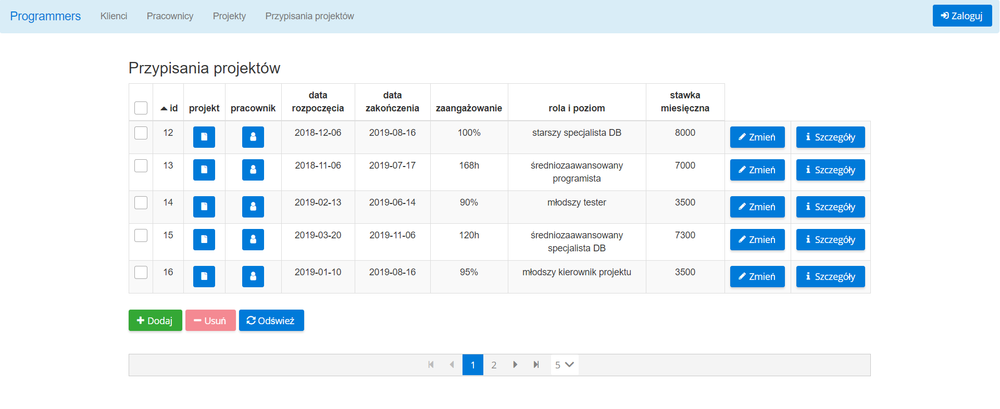
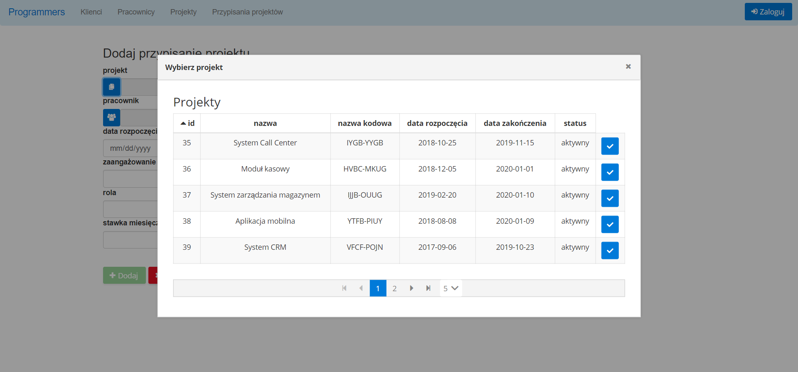
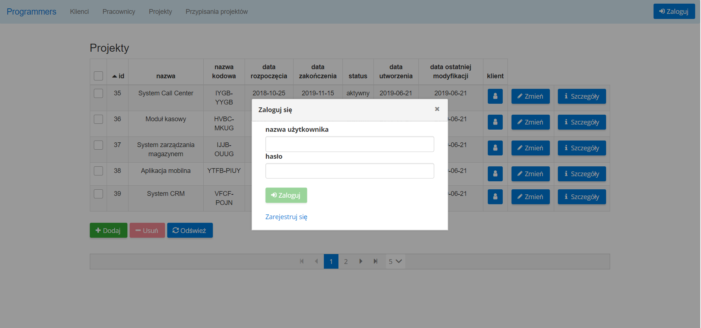
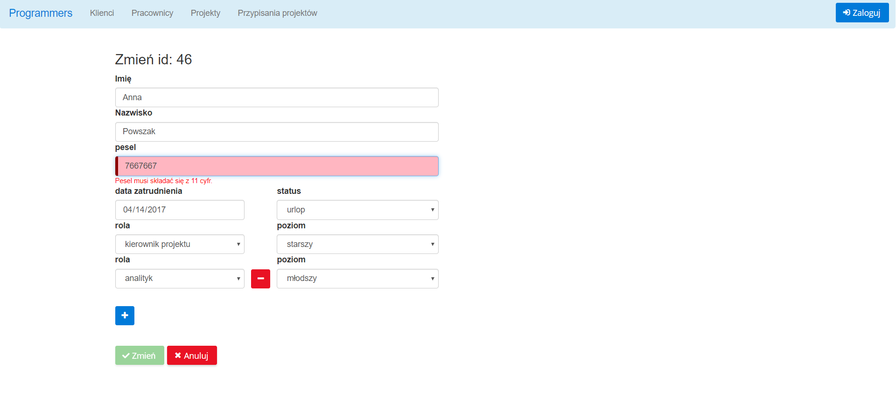

# Programmers

Application for managing the IT company's structure, enabling operations of adding, removing, editing and downloading customers, employees and projects, as well as managing and validating assignments of employees to projects.

Used technologies: Java 11, Maven, MySQL, Spring Boot, Hibernate, JWT Token, Testcontainers, Spock, JUnit, Mockito, Lombok, Angular 7, Bootstrap, PrimeNG.

### Setup database

To create needed tables use scripts:

```
create TABLE `employee`
(
    `id`              int(11)     NOT NULL AUTO_INCREMENT,
    `first_name`      varchar(50) NOT NULL,
    `last_name`       varchar(50) NOT NULL,
    `pesel`           varchar(11) DEFAULT NULL,
    `employment_date` date        DEFAULT NULL,
    `status`          varchar(20) NOT NULL,
    PRIMARY KEY (`id`)
) ENGINE = InnoDB
  DEFAULT CHARSET = utf8
  COLLATE = utf8_general_ci;

create TABLE `employee_role`
(
    `id`          int(11)     NOT NULL AUTO_INCREMENT,
    `role`        varchar(20) NOT NULL,
    `level`        varchar(20) NOT NULL,
    `employee_id` int(11)     NOT NULL,
    PRIMARY KEY (`id`),
    KEY `employee_id_idx` (`employee_id`),
    CONSTRAINT `employee_id` FOREIGN KEY (`employee_id`) REFERENCES `employee` (`id`) ON delete CASCADE
) ENGINE = InnoDB
  DEFAULT CHARSET = utf8
  COLLATE = utf8_general_ci;

create TABLE `client`
(
    `id`                     int(11)      NOT NULL AUTO_INCREMENT,
    `name`                   varchar(100) NOT NULL,
    `code_name`              varchar(20)  NOT NULL,
    `key_account`            int(11) DEFAULT NULL,
    `create_date`            date         NOT NULL,
    `last_modification_date` date         NOT NULL,
    PRIMARY KEY (`id`),
    UNIQUE KEY `code_name_UNIQUE` (`code_name`),
    KEY `key_account_idx` (`key_account`),
    CONSTRAINT `key_account` FOREIGN KEY (`key_account`) REFERENCES `employee` (`id`) ON delete SET NULL
) ENGINE = InnoDB
  DEFAULT CHARSET = utf8
  COLLATE = utf8_general_ci;

create TABLE `project`
(
    `id`                     int(11)      NOT NULL AUTO_INCREMENT,
    `name`                   varchar(100) NOT NULL,
    `code_name`              varchar(20)  NOT NULL,
    `start_date`             date         NOT NULL,
    `end_date`               date DEFAULT NULL,
    `status`                 varchar(20)  NOT NULL,
    `create_date`            date         NOT NULL,
    `last_modification_date` date         NOT NULL,
    `client_id`              int(11)      NOT NULL,
    PRIMARY KEY (`id`),
    UNIQUE KEY `client_project_unique` (`client_id`, `code_name`),
    KEY `client_id_idx` (`client_id`),
    CONSTRAINT `client_id` FOREIGN KEY (`client_id`) REFERENCES `client` (`id`) ON delete CASCADE
) ENGINE = InnoDB
  DEFAULT CHARSET = utf8
  COLLATE = utf8_general_ci;

create TABLE `project_allocation`
(
    `id`                       int(11)     NOT NULL AUTO_INCREMENT,
    `project_id`               int(11)     NOT NULL,
    `employee_id`              int(11)     NOT NULL,
    `start_date`               date        NOT NULL,
    `end_date`                 date    DEFAULT NULL,
    `percentile_workload`      int(11) DEFAULT NULL,
    `hours_per_month_workload` int(11) DEFAULT NULL,
    `role`                     varchar(20) NOT NULL,
    `level`                    varchar(20) NOT NULL,
    `rate_monthly`             int(11)     NOT NULL,
    PRIMARY KEY (`id`),
    KEY `project_id_idx` (`project_id`),
    KEY `employee_id_idx` (`employee_id`),
    CONSTRAINT `employee_allocated_id` FOREIGN KEY (`employee_id`) REFERENCES `employee` (`id`) ON delete CASCADE,
    CONSTRAINT `project_id` FOREIGN KEY (`project_id`) REFERENCES `project` (`id`) ON delete CASCADE
) ENGINE = InnoDB
  DEFAULT CHARSET = utf8
  COLLATE = utf8_general_ci;

create TABLE `address`
(
    `id`                        int(11)     NOT NULL AUTO_INCREMENT,
    `city`                      varchar(50) NOT NULL,
    `street`                    varchar(50) NOT NULL,
    `number`                    varchar(20) NOT NULL,
    `zipcode`                   varchar(20) NOT NULL,
    `country`                   varchar(20) NOT NULL,
  PRIMARY KEY (`id`)
) ENGINE=InnoDB
  DEFAULT CHARSET=utf8
  COLLATE = utf8_general_ci;

create TABLE `user`
(
    `id`                        int(11)     NOT NULL AUTO_INCREMENT,
    `first_name`                varchar(50) NOT NULL,
    `last_name`                 varchar(50) NOT NULL,
    `age`                       int(20)     NOT NULL,
    `date_of_birth`             date        NOT NULL,
    `address_id`                int(11)     NOT NULL,
    `title`                     varchar(50) NOT NULL,
  PRIMARY KEY (`id`),
  KEY `address_id_idx` (`address_id`),
  CONSTRAINT `address_id` FOREIGN KEY (`address_id`) REFERENCES `address` (`id`) ON delete CASCADE
) ENGINE=InnoDB
  DEFAULT CHARSET=utf8
  COLLATE = utf8_general_ci;

create TABLE `user_login` (
  `id`                          int(11)     NOT NULL AUTO_INCREMENT,
  `username`                    varchar(40) NOT NULL,
  `password`                    varchar(100)NOT NULL,
  `user_data_id`                int(11)     NOT NULL,
  PRIMARY KEY (`id`),
  UNIQUE KEY `username_UNIQUE` (`username`),
  KEY `user_data_id_idx` (`user_data_id`),
  CONSTRAINT `user_data_id` FOREIGN KEY (`user_data_id`) REFERENCES `user` (`id`) ON delete CASCADE ON update CASCADE
) ENGINE=InnoDB
  DEFAULT CHARSET=utf8
  COLLATE = utf8_general_ci;

create TABLE `user_role` (
    `id`                        int(11)     NOT NULL AUTO_INCREMENT,
    `role`                      varchar(45) NOT NULL,
    `user_id`                   int(11)     NOT NULL,
  PRIMARY KEY (`id`),
  UNIQUE KEY `id_UNIQUE` (`id`),
  KEY `user_id_idx` (`user_id`),
  CONSTRAINT `user_id` FOREIGN KEY (`user_id`) REFERENCES `user_login` (`id`) ON delete CASCADE ON update CASCADE
) ENGINE=InnoDB
DEFAULT CHARSET=utf8
COLLATE = utf8_general_ci;
```

### Sample screenshots








